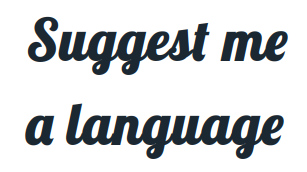

 This work is licensed under a <a rel="license" href="http://creativecommons.org/licenses/by-nc-nd/4.0/">Creative Commons Attribution-NonCommercial-NoDerivatives 4.0 International License</a>.

## What it is...

Repository contains small webservice written in Kotlin and Javascript. It's task
is to recommend programming language to the end user.

At it's heart is extendable and easily modifiable matrix of languages'
compatibilities with carefully crafted criteria. The criteria are 
either binary (yes/no) or numeric (scale 1 to 10). 

UI presents three modes of operation:
* browsing of all languages
* filtering languages based on criteria
* interactive mode

The code is easy to customize and to bend towards company principles,
strategy, etc.

There may be some typos and mistakes here and there, but their number is
relatively low.

Database contains ~50 languages new and old, with all imaginable features
and paradigms. The languages are described with 47 "features".

There are some glitches in JS - sometimes you have to click more than
once on the card or button.

Project has been written and is best opened in IntellJ IDEA Community Edition.

## Modes

#### Browse

It presents all the languages in order from most popular according to 
TIOBE index. By default description and criteria are hidden they are 
presented when card is clicked.

#### Filter

At the top there is list of criterias. Turning them on causes the list
to filter with only matching. Important to note is behaviour of numeric
inputs - you have to fill in the number first then activate the feature.
If you want to modify that number turn off and on that particular feature.
There is no validation, if the number is not valid the behavior is undefined.

#### Interactive

The interaction is based on yes/no question from generated decision tree.
The "splits" were generated to maximize Information Gain on each split.
Due to performance tree has been cut off at depth 10. With answering 
questions as yes the list drills down further and further. There is no
reset button, for reset refresh the page.

## Decision tree

It is written in kotlin. First the markdown document is parsed to list
of languages with attached features.

Then the tree is constructed top to bottom splitting the list based on
following algorithm:
* all features are canditates for split
* if that feature were used what would be entropy of left and right?
* the split is taken with minimum entropy after split
* left and right children are added to the end of the queue with candidate list without that feature
* process repeats but cutdown depth is 10

The splits for numeric features are chosen so that left and right are maximally balanced.

